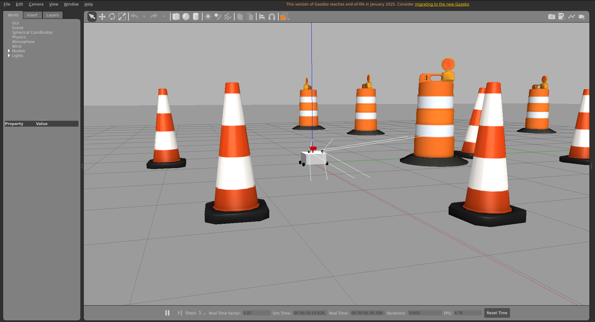
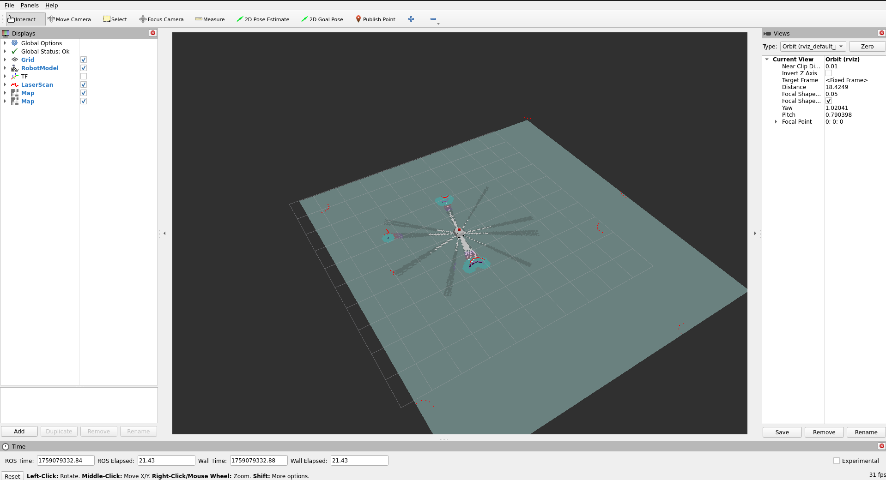

# Autonomous Mobile Robot

This repository provides resources and code for building and simulating an autonomous mobile robot platform with stereo camera, LiDAR, and teleoperation capabilities using ROS and Gazebo.

## Features

- Autonomous navigation with ROS
- Stereo camera integration for 3D perception (Ongoing)
- LiDAR-based mapping and localization
- Teleoperation (keyboard/joystick support)
- Gazebo simulation environment

## Installation

1. Clone this repository:
    ```bash
    git clone https://github.com/nisalperera/mobile_robot.git
    ```

2. Install ROS (recommended: ROS Noetic or ROS2 Humble) and Gazebo on your system (recommended to use Docker).
3. Install required dependencies:
    - ros-${ROS_DISTRO}-ros-gz
    - ros-${ROS_DISTRO}-gazebo-ros-pkgs
    - ros-${ROS_DISTRO}-joint-state-publisher-gui
    - ros-${ROS_DISTRO}-controller-manager
    - ros-${ROS_DISTRO}-twist-mux
    - ros-${ROS_DISTRO}-slam-toolbox
    - ros-${ROS_DISTRO}-controller-manager
    - ros-${ROS_DISTRO}-joint-trajectory-controller
    - ros-${ROS_DISTRO}-joint-state-broadcaster
    - ros-${ROS_DISTRO}-ros2-control
    - ros-${ROS_DISTRO}-ros2-controllers
    - ros-${ROS_DISTRO}-gazebo-ros2-control
    - ros-${ROS_DISTRO}-navigation2
    - ros-${ROS_DISTRO}-nav2-bringup

4. Build with colcon:  
    ```bash
    cd mobile_robot  
    colcon build --symlink-install  
    source install/setup.bash
    ```  

    * Recommended to use `--symlink-install` argument to avoid building the package again and again when code is changed.
    * You must build the package if you add or remove a file even if you use `--symlink-install`


## Usage

- Launch the robot with:
    ```bash
    ros2 launch mobile_robot robot.launch.py
    ```

- Launch the Gazebo and RViz2 in a new terminal with:
    ```bash
    ros2 launch mobile_robot gz.launch.py
    ```

## Gazebo


## RViz2


- Use joystick for manual control (You can change the button config in [joystick config](config/joystick.yaml)).
- Run stereo camera and LiDAR nodes for autonomous tasks (Still under development).

## Project Structure

- `description/` : XACRO file for robot description
- `launch/` : ROS launch files for simulations
- `config/` : Configuration and parameter files
- `maps`: A base map generated from [obstacles.world](worlds/obstacles.world)
- `worlds`: Example worlds in Gazebo
- `CMakeLists.txt` : Build instructions (CMake)
- `README.md` : Project documentation

## TODO

- Update to new Gazebo version
- Complete Stereo camera integration and obstacles detection using cameras
- Integrate real hardware drivers for popular stereo cameras and LiDAR models
- Improve teleoperation script compatibility (joystick, custom input devices)
- Add demonstration videos and example runs in Gazebo
- Expand documentation for source files and usage examples

## License

BSD-3-Clause license

## Author

Based on work by [joshnewans/my_bot](https://github.com/joshnewans/my_bot).

---

For support or contributions, submit issues or pull requests on GitHub.

### Note:
This repo can be used with this [devcontainer](https://github.com/nisalperera/ros2-docker/tree/0.0.1-humble).